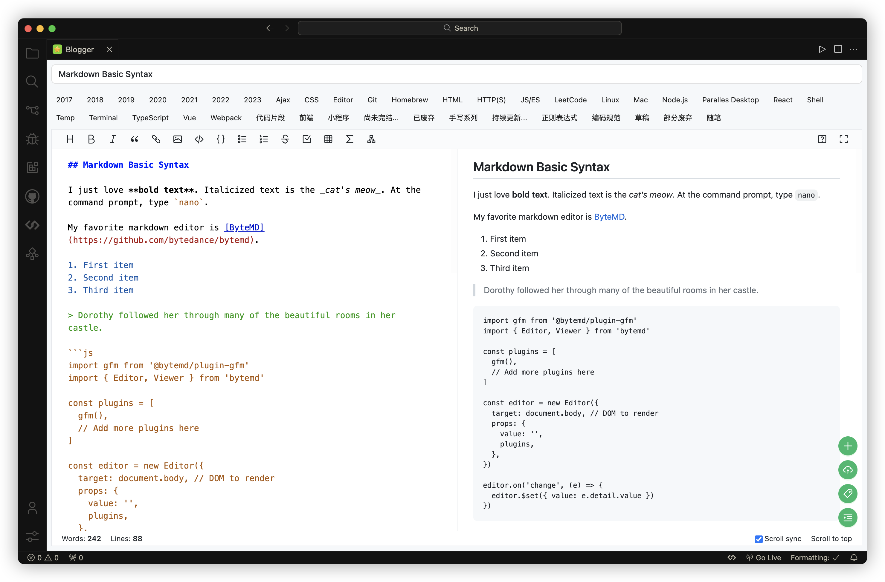
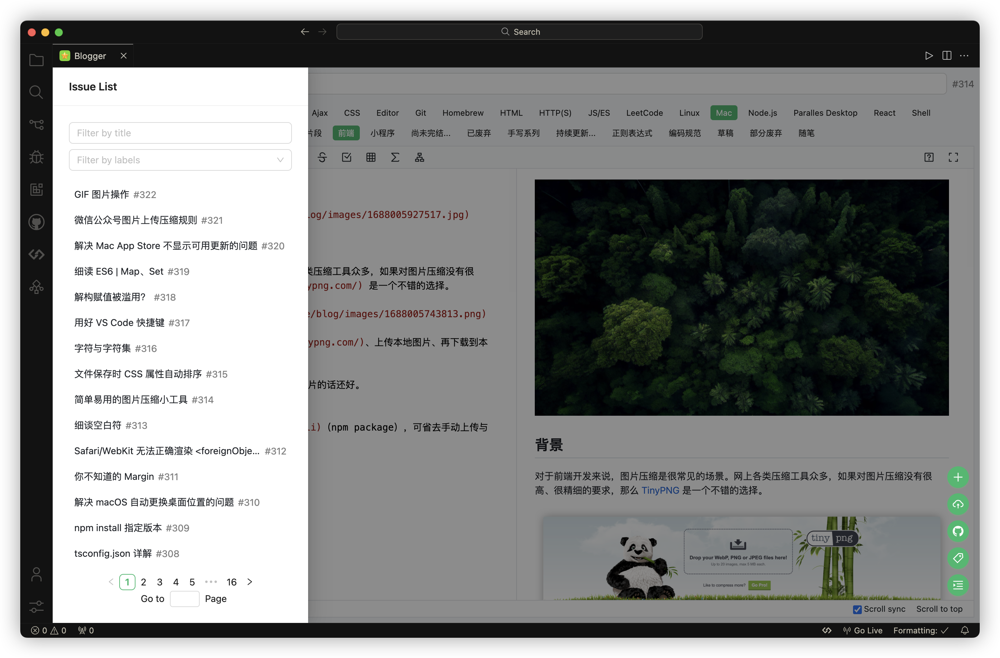
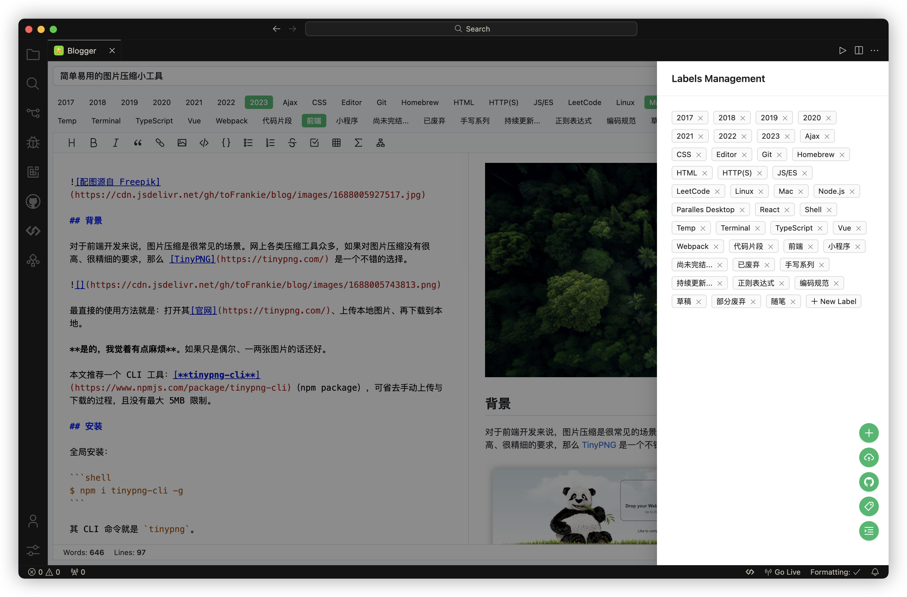

# GitHub Blogger

[](https://deepwiki.com/toFrankie/github-blogger)

**GitHub Blogger** is a VS Code extension that lets you create and manage blog posts with GitHub Issues. Enjoy Markdown editing, preview, and seamless publishing—all powered by GitHub.

## ✨ Features

- Manage and publish blog posts via GitHub Issues.
- GitHub-like interaction experience.
- Markdown editing with real-time preview and plugins (Math, Mermaid, etc.).
- Automatic image upload and CDN acceleration via jsDelivr.
- All your posts and images are stored in your repository.

## 🚀 Quick Start

1. Install from the [VS Code Marketplace](https://marketplace.visualstudio.com/items?itemName=Frankie.github-blogger).
2. Prepare your [GitHub Personal Access Token](https://docs.github.com/en/authentication/keeping-your-account-and-data-secure/managing-your-personal-access-tokens).
3. Open the command palette (`Command + Shift + P` on macOS, `Ctrl + Shift + P` on Windows/Linux), type `Config GitHub Blogger` to set up.
4. Open the command palette again, type `Open GitHub Blogger`, and start writing!

Sample configuration:

```json
{
  "github-blogger.token": "your-github-token",
  "github-blogger.user": "your-github-username",
  "github-blogger.repo": "your-github-repo",
  "github-blogger.branch": "main"
}
```

## ⚠️ Notes

- **Your blog repository must be public** for image CDN acceleration to work ([details](https://github.com/jsdelivr/jsdelivr/issues/18243#issuecomment-857512289)).
- You can use an existing repository or create a new one.
- Posts and images are stored in the `archives` and `images` directories. The branch is set by `github-blogger.branch`. Usually, the default branch is sufficient. Make sure this branch exists, or archiving and image uploads may fail.

## 🙏 Acknowledgements

This project is inspired by and built upon the work of the open-source community, including but not limited to:

- [Aaronphy/Blogger](https://github.com/Aaronphy/Blogger) – Project inspiration
- [@octokit/core](https://github.com/octokit/core.js) – GitHub API toolkit
- [@primer/react](https://primer.style/react) – GitHub's official UI components
- [@tomjs/vite-plugin-vscode](https://github.com/tomjs/vite-plugin-vscode) – VSCode extension tooling
- [bytemd](https://github.com/bytedance/bytemd) – Markdown editor
- [jsDelivr](https://www.jsdelivr.com/?docs=gh) – Free CDN service

## 📷 Screenshots







## 📚 Related Projects

- [github-issue-toc](https://github.com/toFrankie/github-issue-toc): Generate a table of contents for GitHub Issues

## 📝 License

MIT
