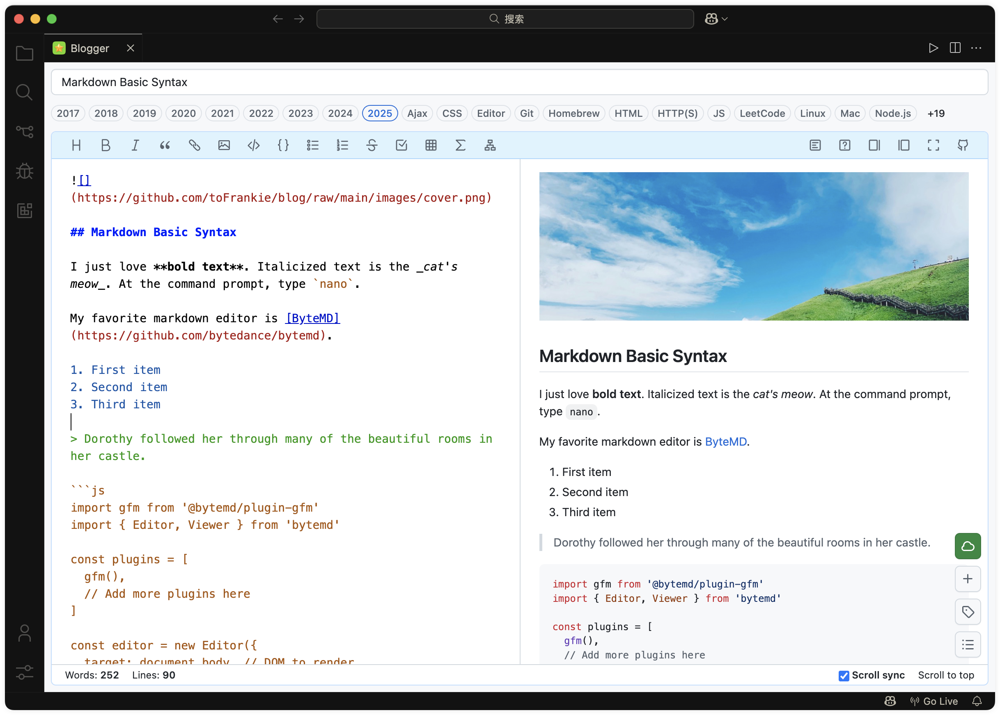
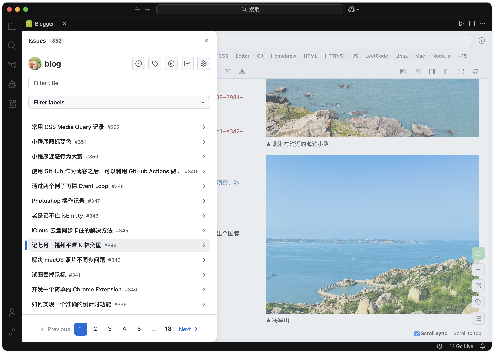
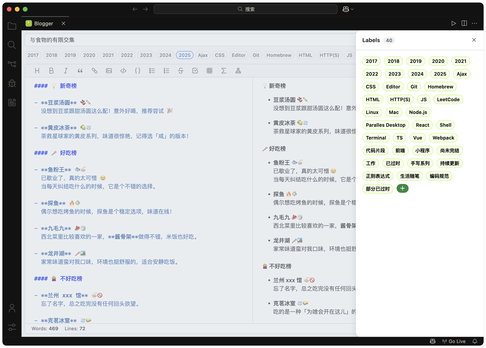

# Github Blogger

> Inspired by [Aaronphy/Blogger](https://github.com/Aaronphy/Blogger).

This VS Code extension lets you create and manage GitHub Issues as blog posts. It uses the GitHub REST API and GraphQL API to handle your Issues, with all content stored in your GitHub repository.

Perhaps you can use it in conjunction with [github-issue-toc](https://github.com/toFrankie/github-issue-toc), which generates the table of contents on the issue page.

## 📖 Quick Start

1. Get the extension from the [Marketpalce](https://marketplace.visualstudio.com/items?itemName=Frankie.github-blogger).
2. Prepare your [Github Personal Access Token](https://docs.github.com/en/authentication/keeping-your-account-and-data-secure/managing-your-personal-access-tokens).
3. Open the command palette (`Command + Shift + P` on macOS, `Ctrl + Shift + P` on Windows/Linux), then type `Config Github Blogger` to finish the initial setup.
4. Open the command palette, type `Open Github Blogger`, and start writing your blog.

```js
{
  "github-blogger.token": "xxx", // Your GitHub Personal Access Token
  "github-blogger.user": "xxx", // Your GitHub Username
  "github-blogger.repo": "xxx", // Your Blog Repository Name
  "github-blogger.branch": "main" // Your Blog Repository Branch Name
}
```

## 💬 Important Notes

- **Make sure your blog repository is public**, as images use jsDelivr + GitHub for CDN acceleration, incompatible with private repos. [jsdelivr #18243](https://github.com/jsdelivr/jsdelivr/issues/18243#issuecomment-857512289)
- Issues and images are stored in the archives and images directories. The `github-blogger.branch` specifies the branch, usually the default. Ensure this branch exists, or archiving and image uploads may fail.

## 📚 About

The extension uses:

- [ant-design](https://github.com/ant-design/ant-design) for the UI.
- [bytemd](https://github.com/bytedance/bytemd) for markdown parsing.
- [octokit.js](https://github.com/octokit/octokit.js) for GitHub API interaction.




